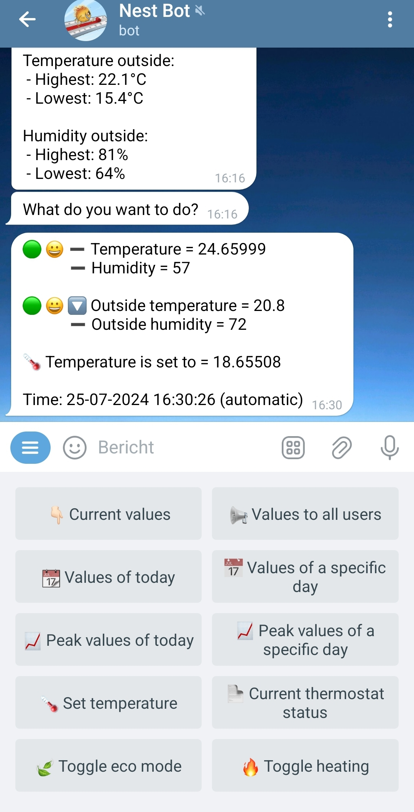

# Google Nest Thermostat Monitoring and Control Telegram Bot

This is a Google Nest Thermostat Monitoring and Control Telegram Bot. The main puropose is that it monitors inside temperatures every 30 minutes, logs those values in an Excel file and sends notifications to your Telegram account. It also allows you to control your Nest Thermostat from your Telegram account.

This project consists of two running services on a Linux server. The nest_bot is responsible for the user interaction with the bot. The nest_monitoring is responsile for collecting Google Nest credentials, the monitoring and logging of values into Excel files.

## Features
- Monitor inside temperatures and humidity every 30 minutes.
- Log values in an Excel file (separate file for each day).
- Log additional information from outside weather station.
- Send notifications to your Telegram account.
- Control your Nest Thermostat from your Telegram account (like setting temperature, mode, etc.).
- Get values from your Nest Thermostat or previous values through your Telegram account.

<center></center>

## Table of contents
1. [Introduction](#google-nest-thermostat-monitoring-and-control-telegram-bot)
2. [Features](#features)
3. [Setup](#setup)
    - [Prerequisites](#prerequisites)
    - [Installation](#installation)
        1. [Clone the repository](#1-clone-the-repository)
        2. [Create a virtual environment for the nest_bot](#2-create-a-virtual-environment-for-the-nest_bot)
        3. [Create a virtual environment for the nest_monitoring and activate it](#3-create-a-virtual-environment-for-the-nest_monitoring-and-activate-it)
        4. [Google Developer Console](#4-google-developer-console)
        5. [Set up your environment variables](#5-set-up-your-environment-variables)
        6. [Change the syspath](#6-change-the-syspath)
        7. [Setting up a Systemd Services](#7-setting-up-a-systemd-services)
        8. [Start the project](#8-start-the-project)
4. [Usage](#usage)
5. [Contributing](#contributing)
6. [License](#license)


## Setup

### Prerequisites
- Google Nest Thermostat (I use a Google Nest 3rd generation)
- You need to setup a project in Google Developer Console.
- A Telegram bot token. You can get one by creating a bot through the [BotFather](https://core.telegram.org/bots#botfather).
- API keys for Weather APIs. Use a dutch site for weather data. You can use other weather data providers as well, just modify the `weather_functions.py` file.
- A working Linux environment.
- Python3 installed on the server.

### Installation

1. **Clone the repository:**
    ```bash
    git clone https://github.com/MadeByAdem/Nest-Monitoring-bot
    cd Nest-Monitoring-bot
    ```

2. **Create a virtual environment for the nest_bot:**
    ```bash
    cd nest_bot
    python -m venv venv
    source venv/bin/activate  # On Windows, use `venv\Scripts\activate`
    ```

    Install the required packages for the nest_bot:

    ```bash
    pip install -r requirements.txt
    ```

    Deactivate the virtual environment:

    ```bash
    deactivate
    ```

3. **Create a virtual environment for the nest_monitoring and activate it:**
    ```bash
    cd ../nest_monitoring
    python -m venv venv
    source venv/bin/activate  # On Windows, use `venv\Scripts\activate`
    ```

    Install the required packages for the nest_monitoring:
    ```bash
    pip install -r requirements.txt
    ```

    Deactivate the virtual environment:

    ```bash
    deactivate
    ```

4. **Google Developer Console**

    To be able to communicate with the Google API, you need to create a project and you have to have certain credentials.

    I made use of the extensive [tutorial of Wouter Niewerth](https://www.wouternieuwerth.nl/controlling-a-google-nest-thermostat-with-python/) to get those details. Please follow his guide until the point you get the following details:
    
    `PROJECT_ID=` \
    `CLIENT_ID=` \
    `CLIENT_SECRET=` \

    You need those details for the next step.

5. **Set up your environment variables:**

    Copy the `.env.example` file to `.env` and change the variables with your variables. 
    ```bash
    cp .env.example .env
    ```   
    You can obtain your Telegram chatID by chatting with the Telegram bot @RawDataBot on https://t.me/raw_data_bot
    
    If you want to change the number of users, add more users to the `AUTHORIZED_USERS` variable in `nest_bot.py` and `telegram_functions.py`.

    The `DEVICE=` variable is not initially used, only on manual functions. Once the project runs, you can find this value in the logs. You can then just replace the value and restart the services.

6. **Change the syspath:**

    In order to change the syspath, you need to change the `sys.path` in the `nest_bot.py` file and `monitoring_nest.py` file. This ensures that both files make use of the nest_functions.

    ```python
    sys.path.append('/your/path/to/nest_bot_and_monitoring_directory/')  # Make sure this line is before the imports
    ```

    If you have obtained al the necessary details, enter them in the `.env` file.

7. **Setting up a Systemd Services**
    Modify the service files:

    Update the `nest_bot.service` file with your actual paths:
    ```ini
    [Unit]
    Description=Nest Bot

    [Service]
    ExecStart=/your/path/to/nest_bot/venv/bin/python /your/path/to/nest_bot/nest_bot.py
    WorkingDirectory=/your/path/to/nest_bot
    Restart=always
    User=root

    [Install]
    WantedBy=default.target
    ```

    Update the `nest_monitoring.service` file with your actual paths:
    ```ini
    [Unit]
    Description=Nest Monitoring

    [Service]
    ExecStart=/your/path/to/nest_monitoring/venv/bin/python /your/path/to/nest_monitoring/monitoring_nest.py
    WorkingDirectory=/your/path/to/nest_monitoring
    Restart=always
    User=root

    [Install]
    WantedBy=default.target
    ```

    Copy the service files to the `/etc/systemd/system/` folder:

    ```bash
    cp nest_bot.service /etc/systemd/system/
    cp nest_monitoring.service /etc/systemd/system/
    ```


8. **Start the project:**

    If all went well, it's time to fire up the project. We need a code from Google Nest. We can retrieve this code using the `monitoring_nest.py` file.

    Go to the `nest_monitoring` folder and run the `monitoring_nest.py` file:

    ```bash
    cd nest_monitoring
    source venv/bin/activate
    python3 monitoring_nest.py
    ```

    This will start the `monitoring_nest.py` file and initialy just prints a URL.
    1. Follow the steps on the URL
    2. After logging in you are sent to URL you specified as redirect_url. Google added a query to end that looks like this: `?code=.....&scope=...` Copy the part between *code= and &scope=* Be quick, the url changes after a few seconds. If you failed to copy, just deactivate and reactivate the script.

        *Note:* if your project is in development mode, the code generated is only valid for 7 days. After that, you have to repeat all steps. If you put your project into production the code keeps working.

    3. If you have copied the code, deactivate the script.

    ```bash	
    deactivate
    ```
    4. Change the code in `monitoring_nest.py`:

    ```bash
    nano monitoring_nest.py
    ```

    Find the line:

    ```python
    code = input("Enter the code returned in the URL: ")
    # code = f"code"
    ```

    Comment out the first line and comment in the second, and place the code from Google Nest in the second line between quotes. Save and exit.

    5. Fire up the services:

    ```bash
    sudo systemctl daemon-reload
    sudo systemctl enable nest_monitoring.service
    sudo systemctl enable nest_bot.service
    sudo systemctl start nest_bot.service
    sudo systemctl start nest_monitoring.service
    ```

    If all went well, the bot will start with an API request to Google and send the data to your Telegram bot. If you do not receive any data, something went wrong.

    Feel free to [contact me](https://madebyadem.dev) if you have any questions.
    
## Usage
From the moment you start the monitoring, the bot will send you notifications every 30 minutes (12.00, 12.30 etc.) with the current temperature, current humidity both inside and outside. The Excel files will be generated automatically.

In the bot you can type /menu to see the options.

If you have specified a serverbot token, which should be different from the nest_bot token, than you'll receive a notification if the bot fails to retrieve information from nest.

## Contributing
Feel free to submit issues or pull requests if you have suggestions for improvements or new features. Please follow the existing coding style.

## License
This project is licensed under the Custom License. See the [LICENSE](LICENSE) file for more details.